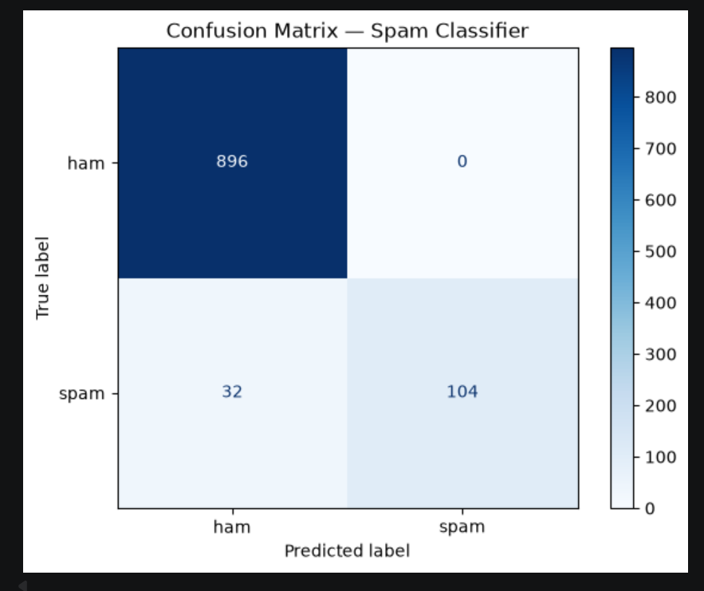

# 📧 SMS Spam Classifier

A machine learning model that classifies SMS messages as **spam** or **ham** (legitimate), built with scikit-learn. My first ML project, following two pandas-focused analysis projects.



## 🎯 Results

| Metric | Score |
|--------|-------|
| Accuracy | **96.90%** |
| Spam Precision | 1.00 |
| Spam Recall | 0.76 |
| Ham Precision | 0.97 |
| Ham Recall | 1.00 |

**Interpretation:**
- The model never flags a legitimate message as spam (perfect ham recall).
- When it predicts spam, it's correct 100% of the time (perfect spam precision).
- It catches 76% of all actual spam — the remaining 24% slip through.

## 🛠️ Tech Stack

- **Python 3**
- **pandas** — data loading and exploration
- **scikit-learn** — TF-IDF vectorization, Naive Bayes classifier, evaluation metrics
- **matplotlib** — visualizations
- **Jupyter Notebook** — interactive analysis

## 📊 Dataset

- **Name:** SMS Spam Collection
- **Source:** [Kaggle](https://www.kaggle.com/datasets/ashfakyeafi/spam-email-classification)
- **Size:** 5,572 SMS messages (5,157 after deduplication)
- **Class distribution:** ~87% ham / ~13% spam

## 🔍 Approach

1. **Load and explore** the data with pandas
2. **Clean** — drop 415 duplicate rows + one malformed row
3. **Vectorize** text into numerical features using **TF-IDF**
4. **Train/test split** — 80% training, 20% testing, fixed random seed for reproducibility
5. **Train** a Multinomial Naive Bayes classifier
6. **Evaluate** with accuracy, precision, recall, F1, and a confusion matrix
7. **Stress-test** with custom messages

## 💡 Key Finding: Distribution Shift

When I tested the model on hand-written modern spam (e.g., "WIN A FREE iPHONE!!!" or "URGENT: Your account has been compromised"), **it sometimes misclassified them as ham.**

The reason: the SMS Spam Collection dataset is from ~2002 — before iPhones, before URL shorteners, before modern phishing tactics. The model never learned these patterns because they weren't in its training data.

This is a real ML phenomenon called **distribution shift** — when production data differs from training data, model performance drops. Real production spam filters address this by **continuously retraining on fresh data**.

This was the most valuable lesson of the project: **accuracy alone hides important truths about a model.**

## 🚀 How to Run

1. Clone this repo:
```
   git clone https://github.com/idfwyy/email_spam_classifier.git
```
2. Install dependencies:
```
   pip install pandas scikit-learn matplotlib jupyter
```
3. Open the notebook in VS Code or Jupyter:
```
   jupyter notebook spam_classifier.ipynb
```
4. Run cells top to bottom.

## 📈 What I'd Do Next

- **Refresh training data** with modern spam (phishing, smishing).
- **Try other models** — Logistic Regression and SVM for text classification.
- **Engineer custom features** — "contains URL," "all-caps density," "money amount mentioned."
- **Handle imbalance** — class weighting or SMOTE to improve spam recall.
- **Deploy it** — wrap the saved model in a Streamlit app for interactive predictions.

## 🧠 What I Learned

- The end-to-end ML workflow: data → features → train → evaluate
- Why TF-IDF works for text classification
- The critical difference between `fit_transform` (training only) and `transform` (everywhere else)
- Why train/test splits matter — and how stratification protects evaluation
- That **precision and recall tell different stories** — accuracy alone can mislead
- That ML models are bounded by their training data — and how to recognize the symptom

---

Built as part of my Python learning journey toward AI engineering. 🚀